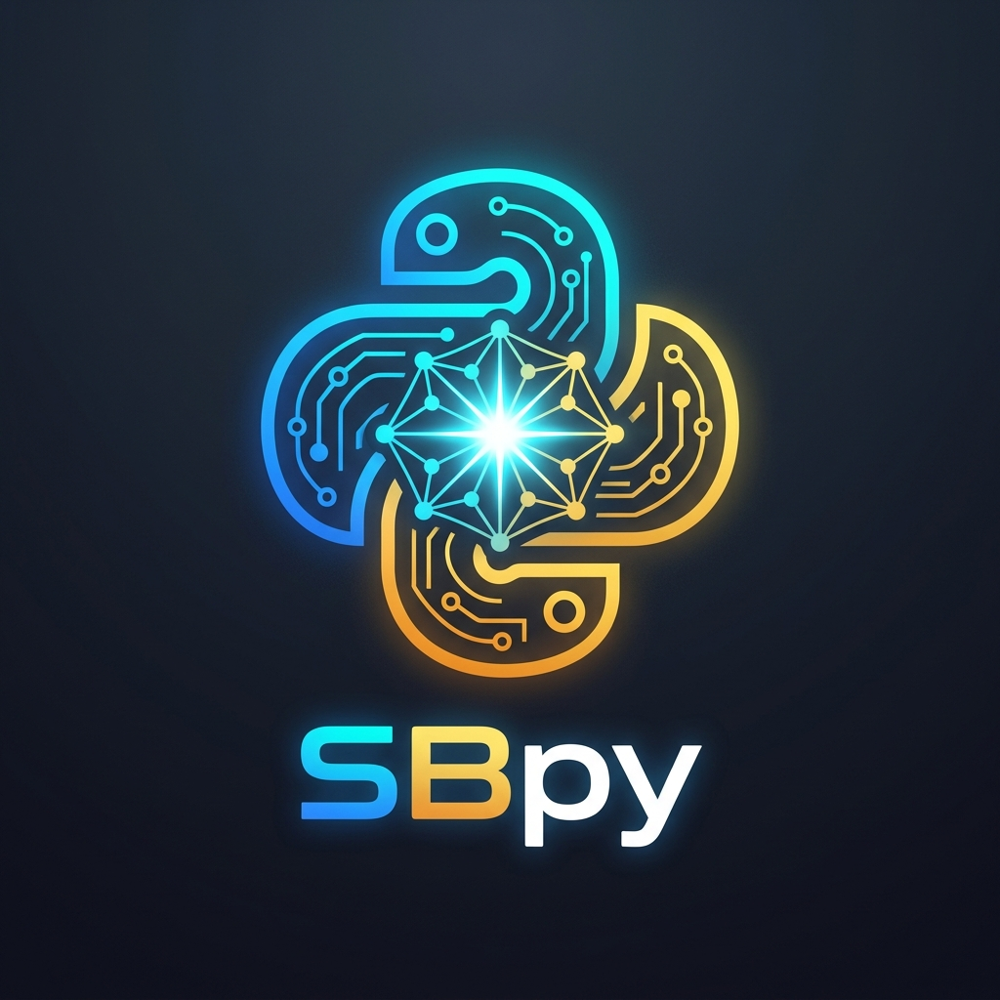

<p align="center">
  
</p>

<h1 align="center">SBpy</h1>

<p align="center">
  <strong>Local-first Python error fixing and static analysis, with Gemini AI as the last resort.</strong>
</p>

<p align="center">
  <a href="https://smartbinary.org"></a>
  <a href="https://github.com/ELISTE770/sbpy"></a>
  <a href="https://pypi.org/project/sbpy"></a>
  <a href="LICENSE"></a>
</p>

---

Most everyday Python errors are straightforward: a mistyped variable name, a missing dictionary key, a forgotten import, or a keyword argument typo. Sending every simple syntax and runtime mistake to a large language model incurs unnecessary latency and API cost.

**SBpy** establishes an intelligent **Escalation Ladder**: every error is analyzed first through ultra-fast, zero-cost local layers. Only errors that truly require deep semantic reasoning are escalated to Google Gemini AI.

```
Layer 1     Local Fixer         Free      difflib · inspect · AST · Project Symbol Index
Layer 2     Static Analysis     Free      53+ AST static linting & security rules
Layer 2.5   Knowledge Base      Free      39+ common Python error patterns & deterministic solutions
Layer 2.6   Learned Rules       Free      Generalized memory of prior AI solutions
Layer 0     Exact Cache         Free      Instant match for identical previous errors
Layer 3     Gemini AI           Paid      Escalated only when all local layers are insufficient
```

Across common Python bugs tested, **100% of standard errors are resolved entirely locally** with zero external API calls.

---

## Three Model Tiers for Cost Optimization

Cost management is built directly into the invocation model:

| When | Tier | Model |
|---|---|---|
| **Automatic escalation** — Runtime uncaught exceptions | `auto` | `gemini-2.5-flash-lite` |
| **Explicit command** — `/...` in REPL or `sbpy explain app.py` | `command` | `gemini-2.5-flash` |
| **`+` suffix or `--pro`** — Complex architecture or deep refactor | `pro` | `gemini-2.5-pro` |

```bash
sbpy sfb app.py                  # Standard flash model
sbpy sfb app.py +                # Upgraded to pro model
sbpy ask "Why is this failing?" app.py --pro
```

```python
>>> /SFB app.py                  # Standard flash
>>> /SFB app.py +                # Pro model
```

---

## Installation

### Windows — Graphical Setup Wizard
Download and run **`SBpy_Setup.exe`** from the [Releases](https://github.com/ELISTE770/sbpy/releases) page or build it locally with `build_installer.bat`.
- Clean destination selector (`%LOCALAPPDATA%\Programs\SBpy`).
- Automatic Desktop and Start Menu shortcut creation.
- Seamless PATH configuration.

### Windows — One-Click Script
```bat
install.bat
```
*(or run `.\install.ps1` from PowerShell.)*

### macOS / Linux
```bash
./install.sh
```

### Standalone Executable
You can run `sbpy.exe` or `sbpy.cmd` directly without installing any global packages:
```bash
sbpy sfb app.py
```

### Configuring API Key & Environment Variables
SBpy operates fully offline out-of-the-box. To enable AI escalation:
```bash
sbpy config set-key "your-gemini-api-key"
# or set environment variable:
setx GEMINI_API_KEY "your-key"
```

You can also customize SBpy with the following environment variables:
- `SBPY_API_KEY`: API Key for AI providers (Gemini, OpenAI, Claude).
- `SBPY_OFFLINE`: Set to `1` or `true` to enforce local-only operation with zero network calls.
- `SBPY_BACKEND`: Selected AI provider backend (`gemini`, `ollama`, `openai`, `claude`).
- `SBPY_LANGUAGE`: Output language (`en` or `he`).
- `SBPY_MODEL_AUTO`: Model for automatic runtime escalation (`gemini-2.5-flash-lite`).
- `SBPY_MODEL_COMMAND`: Model for interactive commands (`gemini-2.5-flash`).
- `SBPY_MODEL_PRO`: Model for deep reasoning tasks (`gemini-2.5-pro`).
- `SBPY_HOME`: Custom config directory location (defaults to `~/.sbpy`).

Run `sbpy doctor` at any time to verify system connectivity and configuration.

---

## Interactive REPL & Console

Running `sbpy` without arguments launches the interactive environment. This is a full-featured Python REPL with built-in active diagnostics: **lines beginning with `/` interact directly with AI and shortcuts.**

```text
  SBpy v0.1.0   Gemini Ready
  Built by Smart Binary • https://smartbinary.org
  GitHub: https://github.com/ELISTE770/sbpy
  python 3.14.5

  Lines starting with / go directly to AI:
    / why is this function slow?      Free-text question
    /SFB app.py                       Shortcut scan on file (also SEC, OPT, CMP, etc.)
    /EXP my_func                      Explain object in current session
    /SETUP                            Interactive model & key setup wizard
    /UI                               Launch local web dashboard

>>> user = {"first_name": "Eli"}
>>> user["frist_name"]
KeyError: 'frist_name'

-- SBpy Error Diagnostics ---------------------------------
  [local]  94% confidence: Key 'frist_name' does not exist in dictionary.
       Suggestion: Did you mean 'first_name'?
-- Resolved locally without Gemini API call ---------------

>>> / How can I validate this with Pydantic?
```

Standard Python decorators (`@property`, `@functools.wraps`, `@app.route`) work normally without interference.

---

## Automated Fixing Engine

SBpy doesn't just diagnose errors — it automatically creates and applies safe, unified diffs:

```bash
sbpy fix app.py             # View proposed unified diff
sbpy fix app.py --apply     # Apply directly to file (with .sbpy.bak backup)
sbpy sfb src/ --fix --apply # Scan directory and fix all issues
```

```diff
-import os
 import json
-    print("hello {name}")
-    if value == None:
+    print(f"hello {name}")
+    if value is None:
-    if value is "empty":
+    if value == "empty":
-    if len(data) == 0:
+    if not data:
-    if "key" in data.keys():
+    if "key" in data:
-    except:
+    except Exception:
```

### Safety Guarantees:
1. Every patch is generated directly from source AST tokens.
2. The modified file is re-parsed with `ast.parse` before writing — if syntax breaks, changes are reverted immediately.
3. Automatic backup (`.sbpy.bak`) is created before modifying files.

---

## Shortcuts Directory

<!-- sbpy:shortcuts:start -->
| קיצור | מה זה עושה | שכבה מקומית | פונה ל-Gemini |
|---|---|---|---|
| `/API` | יצירת Endpoints (FastAPI / Flask) | style | רק אם המקומי לא מצא |
| `/ARCH` | אכיפת ארכיטקטורה ומעגלי ייבוא | כל הפרויקט | אף פעם |
| `/ASK` | שאלה חופשית | — | תמיד |
| `/ASYNC` | המרה לקוד אסינכרוני | opt | רק אם המקומי לא מצא |
| `/CLEAN` | ניקוי קוד (Cleanup) | style | רק אם המקומי לא מצא |
| `/CLONE` | איתור קוד משוכפל | כל הפרויקט | אף פעם |
| `/CMP` | מדד מורכבות | complexity | אף פעם |
| `/DEAD` | איתור קוד מת | כל הפרויקט | אף פעם |
| `/DEBUG` | הוספת לוגים והדפסות דיבאג | bug | רק אם המקומי לא מצא |
| `/DOC` | כתיבת תיעוד | doc | אף פעם |
| `/EXP` | הסבר קוד | — | תמיד |
| `/MOCK` | יצירת Mocks לטסטים | bug | רק אם המקומי לא מצא |
| `/MOD` | שדרוג לתחביר פייתון מודרני | mod | אף פעם |
| `/NAM` | שיפור שמות | — | תמיד |
| `/OPT` | שיפור ביצועים | opt | רק אם המקומי לא מצא |
| `/REF` | הצעת ריפקטור | — | תמיד |
| `/REVIEW` | סקירת קוד מלאה | bug, sec, opt, style | תמיד |
| `/SEC` | סריקת אבטחה | sec | רק אם המקומי לא מצא |
| `/SFB` | חיפוש באגים | bug, style | רק אם המקומי לא מצא |
| `/SOLID` | אכיפת עקרונות SOLID | style | רק אם המקומי לא מצא |
| `/SQL` | בדיקת שאילתות SQL ואבטחה | sec, opt | רק אם המקומי לא מצא |
| `/TAINT` | ניתוח זרימת מידע ואבטחה | sec | רק אם המקומי לא מצא |
| `/TODO` | רשימת משימות בקוד | todo | אף פעם |
| `/TST` | כתיבת בדיקות | — | תמיד |
| `/TYP` | הוספת רמזי טיפוס | type | אף פעם |
<!-- sbpy:shortcuts:end -->

---

## Local Web Dashboard (`sbpy ui`)

Launch the local web dashboard for a visual pair-programming experience:

```bash
sbpy ui
```
- **Live Metrics**: Error density, complexity distribution, and dependency tree.
- **AI Pair Programmer**: Interactive chat with direct code application.
- **Visual Dependency Graph**: Real-time project module graph with circular import detection.
- **Crash Time-Travel**: Interactive inspection of recent stack traces and variables.

---

## Autonomous Self-Healing Tests & Agent

```bash
# Run tests and automatically patch failures until passing:
sbpy heal --cmd "pytest tests/"

# Autonomous multi-step developer agent:
sbpy agent "Refactor data loader to use async httpx and add unit tests"
```

---

## CI/CD Integration

### GitHub Actions
Generate a ready-to-use GitHub Actions workflow:
```bash
sbpy init-ci
```

### Pre-Commit Hook
Install git pre-commit hook to prevent bugs from being committed:
```bash
sbpy install-hook
```

---

## Project Information

- **Organization**: [Smart Binary](https://smartbinary.org)
- **Repository**: [https://github.com/ELISTE770/sbpy](https://github.com/ELISTE770/sbpy)
- **Author**: Eli ([@ELISTE770](https://github.com/ELISTE770))
- **License**: MIT License
